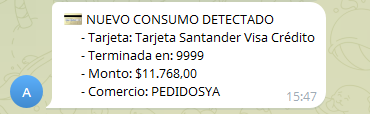

# GmailCardNotifier

**GmailCardNotifier** es una herramienta que monitorea tu bandeja de entrada de Gmail en busca de correos de consumo de tarjeta de crédito y envía notificaciones automáticas a Telegram.

Está implementado en Google Apps Script, por lo que corre 100% en tu cuenta de Google sin necesidad de servidores.

---

## Importante
Esta herramienta está diseñada específicamente para clientes de **Banco Santander**, ya que analiza un formato de correo particular que envía esta entidad.  
Puede requerir adaptaciones si querés usarlo con correos de otros bancos o tarjetas.

---

## Funcionalidades
- Detecta automáticamente correos de pago de tarjeta de crédito (basado en el asunto).
- Extrae información clave como:
  - Últimos 4 dígitos de la tarjeta.
  - Nombre del comercio.
  - Monto pagado.
- Envía un mensaje de alerta personalizado a un chat de Telegram.

---

## Requisitos
- Cuenta de Gmail.
- Bot de Telegram creado y token de acceso.
- ID de chat de Telegram donde quieras recibir las notificaciones.

---

## Instalación y configuración

1. Accede a [Google Apps Script](https://script.google.com/).
2. Crea un nuevo proyecto y copia el código de este repositorio.
3. Configura las siguientes variables:
   - `TELEGRAM_BOT_TOKEN`: Token de tu bot de Telegram.
   - `TELEGRAM_CHAT_ID`: ID de chat donde enviar los mensajes.
   - `CONFIG.subjectFilter`: El filtro de búsqueda de Gmail (por ejemplo: `subject:"Pagaste $" newer_than:1d`).

4. Autoriza los permisos que la app te solicita (acceso a Gmail y a servicios externos).
5. Configura un **trigger** para que la función `checkCreditCardEmails` se ejecute de forma periódica (por ejemplo, cada 5 minutos).

---

## Estructura del proyecto

- **checkCreditCardEmails()**  
  Busca correos nuevos que coincidan con el filtro, extrae los datos y envía las alertas.

- **extractImportantInfo(body, subject)**  
  Extrae el número de tarjeta, el monto y el comercio del cuerpo del correo y el asunto.

- **sendTelegramNotification(message)**  
  Envía un mensaje de texto al chat de Telegram usando el Bot API.

---

## Ejemplo de notificación

## License

This project is licensed under the MIT License - see the [LICENSE](LICENSE) file for details.
